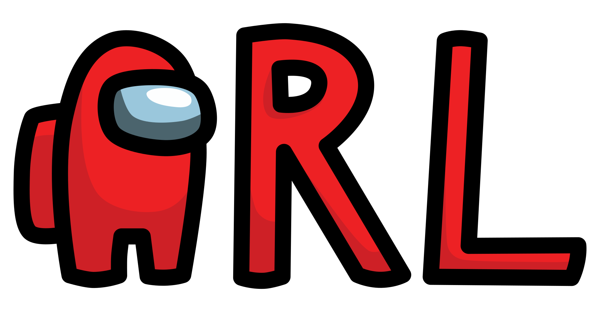

# 

The popular game _Among Us_ made in real life as part of a University project. Not endorsed or associated with the original game or the developers in any way.

## Gameplay Instructions

Among Us IRL is a social deduction game of teamwork and betrayal. This project adapts the game concept of [Among Us](https://store.steampowered.com/app/945360/Among_Us/) to fit into the real world. The original game is set in space but this real world version can be played in any setting.

### Setup

The Task Stations need to be distributed across the play area which should consist of at least 3 rooms. Communicate to all players where the different stations are placed. The Emergency Button should be placed in a central location within the play area.

<table border="0">
 <tr>
    <td>

#### Hosting the Game

The game host is the first player who presses the “Start Game” button on the website. This player can change the game settings and start the lobby.

When changing the number of Imposters, keep in mind the amount of players. For a balanced game, have at least 4 Crewmates for every Imposter. You can set the number of imposters to either 1 or 2\. The meeting time can be set to any time between 30 seconds and 4 minutes.

After confirming the game settings, take one of the unused player tags and scan it. This is now your player tag.

Wait for all players to join the lobby (at least 5 players) before pressing the “Start Game” Button.

</td>
<td>

#### Join a Game

To join a game, press the “Start Game” button on your device. After this, please scan the Emergency Button station. Then take one of the unused player tags and scan it. This is now your player tag.

</td>

 </tr>
</table>

### Game Rules

The game is split into two groups of people: Crewmates and Imposters. Crewmates work together and complete their tasks to win the game while Imposters try to eliminate other players without getting caught.

#### Rules

1. If you get killed, please stay in the same spot until the next meeting or until someone finds you. Don't tell anyone who killed you\!
2. If you find a dead crewmate, please scan their tag to report their body. This will start an emergency meeting. Imposters can also report dead crewmates.
3. When an Emergency Meeting is active, stop whatever task you are doing and go to the Emergency Button station. Dead players also need to stop their tasks while the meeting is active but cannot participate in the meeting.

#### Crewmate

Crewmates have two options to win: voting out all Imposters or completing all tasks.

You have to complete tasks and win with the other Crewmates when all tasks are completed and the needed amount of players are scanned. Your tasks are displayed at the top of the screen during the game. You also need to scan other player’s tags. This screen will also display a “Kill” button that only the Imposters can activate.

The other way to win is to vote out all Imposter. Try to figure out who the Imposters are without getting killed. Together with the other Crewmates you can vote them off to win.

If you get killed, complete your tasks to win together with the other Crewmates.

#### Imposter

Imposters try to eliminate all other players without getting caught.

You have a list of tasks just like the Crewmates which you can do to blend in with the Crewmates. Your main task is to discreetly kill other players. You can kill Crewmates by clicking the "Kill" button after scanning another player's tag. This button is visible for all players but only works for Imposters.

You win (together with the other Imposter) when the same number of Crewmates is alive as alive Imposters (2 Imposters alive win when only 2 Cremates are alive).

Don't get caught\!

### Win Conditions

The game has three different win conditions. Crewmates can win as a team by completing tasks and scanning enough players. Another way Crewmates can win is by voting out all Imposters. Imposters can win (as a team) by eliminating enough Crewmates without getting caught.

## Hardware: Stations

Every station is equipped with a LoRa RA-02 module for communication and a NFC tag where the user has to log in at the station before starting to play the game.  
The circuit diagrams below all include a link that will redirect you to the corresponding circuit in a web editor. You can use this to more closely look at the components used.

### Lights Out

At the beginning of this station, a random pattern of lights is lit up. Press any button to toggle that light and its adjacent lights (up, down, left, right). To win the game the user has to turn off all lights.

<table border="0">
 <tr>
    <td></td>
    <td></td>
 </tr>
 <tr>
    <td>Start</td>
    <td>
Goal</td>
 </tr>
</table>

The game station “Lights Out” is built using a NeoTrellis 4x4 and an ESP32. The code generates a random simple pattern that must be solvable every time. After game completion, the program sends a LoRa message and shows a short rainbow animation on the light matrix.

### Wires

Wires is a simple game of connecting the wires in the correct order. After logging in with your smartphone, the manual of how to connect the four wires will be shown on your screen.

<table border="0">
 <tr>
    <td></td>
    <td></td>
 </tr>
 <tr>
    <td>Station</td>
    <td>App Instructions</td>
 </tr>
</table>

  
The Wires station is built using 4 wires and 4 resistors. The program sends a current through the wires one after the other and therefore can check if the wires are connected correctly.

### Simon Says

This station starts by lighting up one colorful LED, the player has to then press the button that matches the color of the LED. In the next stage, the game will light up two LEDs, the first being the same as in the stage before, the second being new information. The player then has to press the correctly colored buttons in the same order. This will be repeated for seven stages in which the sequence of lit-up LEDs will increase by one new blink every stage. After correctly entering the sequence of seven blinks the task is completed.

<table border="0">
 <tr>
    <td></td>
    <td></td>
 </tr>
 <tr>
    <td>Station</td>
    <td>Gameplay</td>
 </tr>
</table>

  
Simon Says uses 4 different colored LEDs and matching colored buttons. The code will generate a random pattern and check if the correct buttons are being pressed and reset if a mistake was made or send the task completion message after the seven stages are completed.

### Safe Cracking

This task can be solved by turning a dial that is imitating a safe lock until the LEDs all turn green one by one. The secret code of the safe is generated randomly at the beginning of the task.

### Levers

This station consists of 4 levers that need to be switched on and off in the correct pattern. The LEDs indicate how many levers are currently switched correctly. The task is complete when all LEDs are turned on. The pattern is randomized at the start so that players have to complete different patterns every time they begin the task.

### Emergency Button

The Emergency Button can be used to call an Emergency Meeting. When the button is pressed, the station plays a short tune and notifies all other players. This station additionally functions as the base station and has the Game Chip built in. This chip needs to be scanned to register for the game or to register into meetings.

## Frontend

### Gameplay

The frontend was implemented using SolidJS, which is similar to React, but utilizes granular reactivity via Signals and generally performs better than React.

Through the frontend, the user can interact with the digital part of the game. That includes the meeting, scanning players, checking the task progress, learning about your role or your current task.

To begin, players start in the Lobby. Here players have the option to host a new lobby or join an existing one. The data for this (and everything else), is received from a WebSocket. For additional checks and firing events from the client, there is also a REST API.

Once a player has found a lobby, they have to register at the base station and then sync their chips. Next up they can choose a nickname and then wait for the host to start the game. The host currently doesn’t need to register at the base station, but has an extra screen to configure the game settings \- how many imposters are there (1 or 2\) and how long should the emergency meetings be at most (30s-4min).

After the host clicks the start button, all players are moved to the game screen. Here they see the task progress and scan player progress. Currently, every player needs to complete 3 tasks and a total of _player count squared_ players need to be scanned. This is still up for change, as there are some balancing issues, like e.g. Imposters also need to complete all their tasks for the crewmates to win.

From there, players are on their own and should complete their tasks, displayed on the page. However they still got the option to read up on their role any time and read the general gameplay instructions on the main page.

When a player approaches a station, they put their phone in a scan spot to interact with the NFC tag. Once scanned, their phones will display instructions for their current task and the server is informed about the current task of the player. After task completion, the instructions automatically close and the player returns to see the increased task progress bar.

Players can also scan other players. This is possible by holding your phone to another player's tag. This will reveal if the player is alive or dead and autoreport it in the second case. The phone screen of the person who scanned the tag will also display this information, as well as a kill button. This button is however only clickable, if the person is actually the imposter.

If a person has been killed, they will feel a vibration and see a screen telling them that they have perished and should stay in the same location. After the dead’s tag has been scanned by an alive player, an emergency meeting will be called, and every player will again feel a vibration and be told by an on screen prompt to return to the emergency button. Clicking the physical emergency button will show the same vibration and on screen prompt.

Upon arriving at the emergency meeting spot, players have to register at the base station. Once all players have arrived at the meeting, discussion/voting starts. Players can only vote once and need to confirm their voting.  
After all players have voted, the meeting ends in no result (skipped, tie, timeout, no votes) or by ejecting the single person with the most votes. The result is shown on an extra screen with a tiny animation in the case of ejecting a player.

The Crewmates win, if enough tasks have been completed, or if all imposters get ejected during a meeting. The Impostors win if they kill all crewmates, so that there is an imposter count \>= crewmate count. If the game ends, the win screen for the corresponding group is shown and a vibration is played to let everyone know. After a few seconds the screen disappears again and players are sent to the main menu, where they can start a new game.

### NFC Reading/Writing

The game heavily relies on reading/writing to NFC tags. Luckily the web has an API for those. Unfortunately, it is only available on chrome/android… Below is a code snippet showcasing the workflow in the Lobby. First we create a NDEFReader and start scanning for chips. Then we add an event listener for reading (and for if reading fails). In there we check what type of message we receive. The base station has a link to the website and uses the url pattern. The player ids (and stations) use texts. These player ids are on specific chips, we have prefixed with \_playerid\_\_. Whenever we scan such a tag during tag registration, we overwrite it with the new player id. It is important to wait and see if the write was actually successful, or else we might write to another tag, or not write data at all. Hence the then() and catch() calls.

### Code Structure

The top level component of the game is the _App_. Here, the game decides, if it should show the _Lobby_ or the _Game_, or an info that the game is already running, or during development, the _Debug_ UI.  
In the Lobby, the game has its own state handling code to show different phases, like welcome, registration, sync chip, game settings, or waiting for host/players. The Lobby also has to handle NFC reading.

The Game file is responsible for showing the game state. The main screen shows the progress bars and, depending on some internal playstate, different informations. By default the tasks and some information to read up. Other pages are handled in their own files. In some cases, the screen should be covered and task progress does not need to be shown, which is handled by the following checks.

Sometimes it is required to show multiple players. E.g. for the win screen or the imposter role screen. Here, the PlayerRow Helper is used, which shows the players in a V shape. The first player in the array is shown in the front, which is helpful if you want to show your own player in front.

Some components also had technical reasons, not just structural. E.g. The Meeting is utilizing onMount to notify players and onCleanup to show a different screen for a certain timeout once the meeting ends.

## Backend

For the backend, we decided to use NestJS. It’s based on NodeJS, but has typescript support and we have good experience with it.

The backend is responsible for saving the current gameState:

As this is a prototype, we didn’t implement a database. The gameState is only saved in memory. Which means when the server crashes or is restarted, the current gameState is gone.

### API

We designed a REST API to communicate and edit the gameState:

/reset \-\> resets the games state as if the server was just started  
/open \-\> opens a game and initializes variables, such as the first players’ Id  
/join \-\> a player can join with its playerId to the open game  
/start \-\> Starts the game. An imposter is chosen out of the connected players. The gameState is updated.  
/gameState \-\> returns the current gameState  
/kill \-\> saves which player is killed to the gameState  
/emergency \-\> sets the emergency button pressed flag and initializes the meeting to be open for voting  
/bodyFound \-\> same as emergency button, but sets a different flag, so the frontend knows that a body is found  
/registerVoting \-\> called when a player is at the baseStation and registers as “ready for voting”, so the voting can start when all players registered  
/voteFor \-\> vote for another player to be killed  
/startStation \-\> called when a station is started  
/completeStation \-\> not called because LoRa sends it (just for testing) \- but is the same as when a LoRa device sends that its station is completed  
/setStationData \-\> not called because LoRa sends it (just for testing) \- when a station needs to set some settings that need to be visible in the frontend

Wires:  
/wires \-\> get the current wires configuration  
/wires/save \-\> not called because LoRa sends it (just for testing) \- saves a wires configuration

### LoRaWAN and TTN

To get the data that game stations are sending, we are accessing The Things Network (TTN). In The Things Network, every game station is its own device.

The following section describes setting up one device, with the “wires” game as an example:

1. Register at TTN and go to the Console
2. Create an application
3. In the application create a device
4. Set the following specifications and generate JoinEUI (All zeroes), DevEUI, AppKey, NwkKey:
   1. make sure to copy msb (most significant byte) hex numbers
5. 
6. After creating the device, in device settings, make sure to Enable “Resets Join nonces”
7. Your device should be ready to receive data from a LoRa device.

For every game, the same procedure has to be done, we created devices with those device_ids:

- wires
  - The wires connecting game station
- simon
  - The simon says game station
- levers
  - The switch the levers game station
- lightsout
  - The lightsout game station
- safecrack
  - The safe cracking game station
- emergency
  - The emergency button

The data that is sent by the devices is sent as bytes and encoded as base64 strings. Which means we need to encode that and bring it into some easier readable format. TTN offers payload formatters on application level. We define one for the uplink (when receiving data).  
Choose “Custom JavaScript formatter” as we want to have the data in a JSON format, which is perfect for NestJS and typescript.  
Our simple formatter looks like this:

It takes the data as bytes and transforms it to a string in the JSON format.

Now, we need a MQTT bridge to receive the data from TTN and do something with it.  
We decided to directly use the data from the bridge in our backend. Another option would have been to have a dedicated service that acts solely as a bridge and posts the data into MQTT Broker topics. The backend could then listen to the topics and retrieve the data from there, or an integrator could call our endpoints. But for the simplicity of a prototype, directly processing the data in the MQTT bridge was good enough.

### MQTT Bridge

NestJS offers a package called “mqtt”. The official documentation: [https://docs.nestjs.com/microservices/mqtt](https://docs.nestjs.com/microservices/mqtt)

So we install the package:  
npm install –save mqtt

Sample code to define the bridge service:  

Don’t forget to inject the MqttBridgeService in your app module.

On ‘message’ received: We parse the payload and look for the device_id and the received data in the text field. By that we can do different things based on the device_id that we get from TTN.  
As we also have the appService injected to our bridge, we can alter the games’ state.
